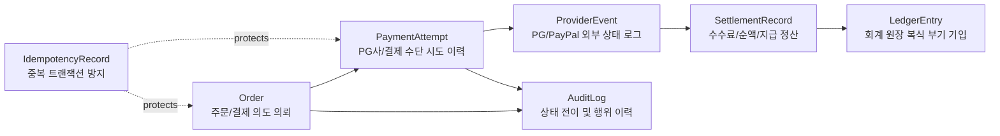
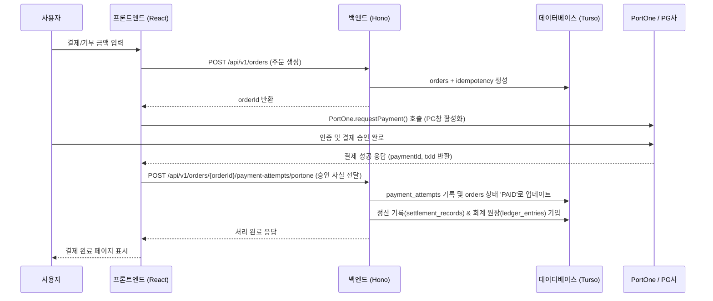
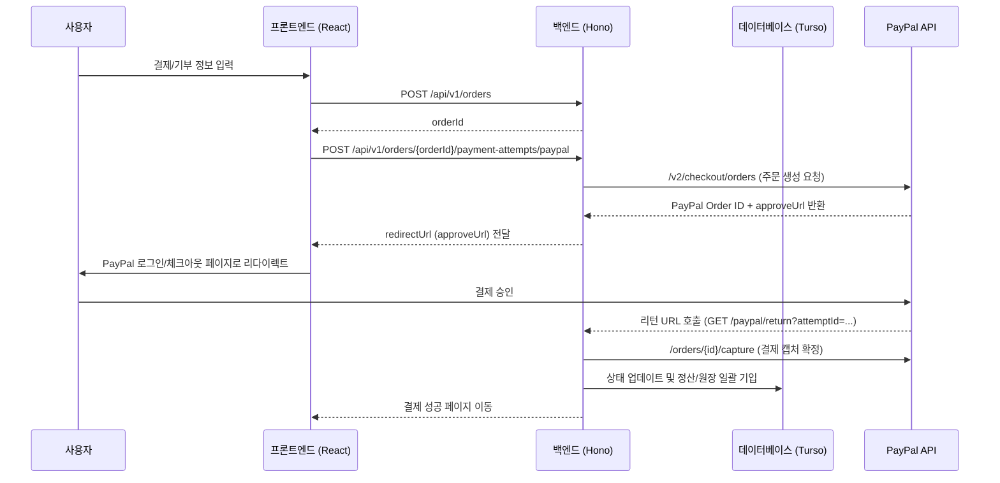

# 💳 payment-backend (국내 PG망 및 글로벌 PayPal 하이브리드 결제 코어)

[](LICENSE)
[](https://hono.dev/)
[](https://portone.io/)
[](https://developer.paypal.com/)

> **Hono + Vercel Serverless + Turso DB 환경 위에 구축된 대한민국 PG사(토스페이먼츠, 카카오페이, 카드 등) 연동을 위한 PortOne V2 어댑터 및 해외 결제를 위한 PayPal Checkout 통합 결제 API 코어 백엔드입니다.**

---

## 🏗️ 아키텍처 및 도메인 모델

결제의 신뢰성 확보 및 정밀 정산/감사를 위해 아래와 같은 표준 회계원장(Ledger) 및 중복요청방지(Idempotency) 구조를 가집니다.



### 테이블 설계 요약
- **`orders`**: 주문 혹은 기부 요청 의도. 주문금액, 통화(KRW, USD 등), 현재 상태 저장.
- **`payment_attempts`**: 결제사(PortOne 또는 PayPal) 거래 고유 식별자와 연결된 실제 결제 승인/시도 기록.
- **`provider_events`**: PG/PayPal로부터 수신된 Webhook 원본 및 API 응답 상세 페이로드 보관.
- **`settlement_records`**: 결제 대행 수수료(Fee), 매출 순액(Net) 및 정산(Payout) 대기 관리.
- **`ledger_entries`**: 거래별 차변(Debit)/대변(Credit) 회계 원장 기록.
- **`idempotency_records`**: 중복 결제 시도 및 네트워크 재요청 오류 방지용 키 검증 테이블.

---

## 🔄 결제 처리 파이프라인

### 1. 국내 PG 연동 (PortOne V2)
국내 신용카드, 카카오페이, 토스페이 등은 **PortOne SDK**를 통해 프론트엔드에서 결제창을 호출한 뒤 백엔드에서 검증 및 정산을 진행합니다.



### 2. 글로벌 해외 결제 (PayPal)
해외 카드는 PayPal Orders/Capture API 및 Webhook 백스톱 검증을 바탕으로 처리됩니다.



---

## 🛠️ 주요 API 명세

### 1. Public API
- `POST /api/v1/orders` : 신규 결제 주문 생성 (멱등성 키 제공 가능)
- `POST /api/v1/orders/:orderId/payment-attempts/portone` : PortOne PG사 결제 승인 내역 연동 및 원장 기입
- `POST /api/v1/orders/:orderId/payment-attempts/paypal` : PayPal 결제 승인 요청 발송
- `GET /paypal/return` : PayPal 승인 후 캡처 콜백 경로
- `POST /api/v1/webhooks/paypal` : PayPal 정산 데이터 싱크 및 백스톱 웹훅
- `GET /api/v1/orders/:orderId` : 특정 주문 상세 조회

### 2. Admin API (X-Admin-Password 게이트웨이)
- `GET /api/v1/admin/dashboard` : 전체 거래액, 수수료, 수단별 점유율 통계 대시보드
- `GET /api/v1/admin/tables` : 데이터베이스 테이블 목록 반환
- `GET /api/v1/admin/tables/:tableName/rows` : 특정 테이블 데이터 조회 (페이징 지원)
- `PATCH /api/v1/admin/tables/:tableName/rows/:rowId` : 수동 정산 상태 및 비정상 거래 정정 조치

---

## ⚙️ 환경 변수 및 설정 (`.env`)

```env
FRONTEND_BASE_URL=https://pay.ai-ing.org
PUBLIC_BASE_URL=https://api.pay.ai-ing.org
CORS_ALLOWED_ORIGINS=https://pay.ai-ing.org,https://www.ai-ing.org

# Admin
ADMIN_PASSWORD=your_secure_password

# Database (Turso SQL DB)
TURSO_DATABASE_URL=libsql://your-db-name.turso.io
TURSO_AUTH_TOKEN=your_turso_auth_token

# PayPal
PAYPAL_ENV=sandbox # sandbox or live
PAYPAL_CLIENT_ID=your_paypal_client_id
PAYPAL_CLIENT_SECRET=your_paypal_client_secret
PAYPAL_WEBHOOK_ID=your_paypal_webhook_id
```

---

## 📄 라이선스 (License)

본 결제 코어 백엔드 프로젝트는 **[MIT License](LICENSE)**에 의거하여 배포됩니다.
